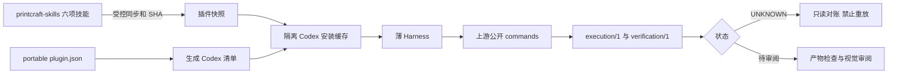

# PrintCraft 插件实施验收（2026-10-08）

候选 0.1.0-dev.3；OpenSpec change: harden-printcraft-plugin-delivery。**21/24 项任务完成**；正式身份/发布与最终归档仍开放。

## 实现

六项上游快照与一项本地 printcraft-harness 精确分开计数。候选来源绑定 sourceProject、sourceVersion、suite SHA 和逐文件 SHA，禁止非空 releaseTag/sourceCommit 冒充候选。正式锁校验 tag/commit/版本格式，但离线检查只报告 OFFLINE_IDENTITY_ONLY_REMOTE_NOT_VERIFIED，不伪称远端已验证。

作者端校验清单字段、类型、SemVer、组件、已知宿主扩展与资源；根 portable 清单生成 Codex 兼容清单，同名同版本。此作者端严格校验不是一个新的客户端加载器，不替代宿主实际容错规则。

Harness 只委托包内上游公开入口，消费 execution/1 / verification/1。UNKNOWN/部分失败不重放；零退出待验收；显式入口保留，已有授权复用，定向修订由上游摘要绑定规则负责。没有复制 PDF 执行实现。



## 验证结果

| 层 | 结果 | 证据 |
|---|---|---|
| 插件本地回归 | 12/12 PASS | handoff-local-tests.log、tests/ |
| 单独检出 | 无技能源兄弟目录仍 PASS | isolated-repository.json |
| 来源/包完整性 | 六上游+一本地 PASS | candidate-source.json、upstream/skill-suite.json、validator |
| Codex 0.153.4 安装/加载 | 含中文/空格的隔离 marketplace 安装，plugin/read 加载七项技能及界面 | plugin-read.json |
| 显式技能调用 | 实际读取 setup/use/Harness 并运行脚本 | model-explicit-compatible.jsonl、model-pdf-current.jsonl |
| 自然语言插件选用 | 实际选择技能、诊断或只读恢复 | model-natural-compatible.jsonl、model-natural-unguided.jsonl |
| 当前完整 PDF 模型任务 | 查询 Schema、--input/--expect、单会话重排、另存、新进程 verify、Harness 展示 PASS | model-artifacts/、model-pdf-current.jsonl |
| 实际 UNKNOWN 恢复 | 模型对真实中断回执只读 reconcile，保持 UNKNOWN，无重放 | model-pdf-current.jsonl |
| 真实隔离更新 | 候选夹具 dev.2→dev.3，用户任务数据不变；旧回执拒绝恢复、回退被拒绝 | update-report.json |

模型使用 CLI 实际目录列出的 gpt-5.6-sol，复用现有登录的临时链接在退出后移除，凭据未读取/复制/归档。最初无登录返回 401；复用登录后 gpt-6-astra 被服务端要求新版 CLI。兼容模型通过不等于当前 gpt-6-astra/所有模型通过；没有升级全局 CLI。

曾用默认只读沙箱执行 PDF，真实目录查询失败于运行时安装互斥文件。该尝试未进入编辑、未生成输出，不能算通过。随后仅对隔离验收目录启用 workspace-write，使用全新输出重试并实际成功。对 UNKNOWN 的恢复只读没有重试写入。

实际模型 PDF 验收为 DETERMINISTIC_PASS_REVIEW_REQUIRED，视觉保持 NOT_RUN；没有把模型最终口头回答或进程退出 0 当作业务证明。随后本轮主任务实际检查模型产物三页 PNG，对同 SHA 的归档副本重新验证来源页映射并签署独立视觉审阅，combined-verification.json 为 VERIFIED；审阅者为 Codex 图像检查，不是人工签署。上游五项原创夹具亦有独立视觉证据。模型原始回执保留原样，两层结果分别保存。

模型日志中的环境全局技能可能被宿主发现；PrintCraft 实际加载/执行文件均在隔离缓存/marketplace，无开发工作区依赖。plugin/read 的组件列表与普通 skills/list 范围不同，后者返回零项不能据此判定插件缺失。

## 更新与发布边界

Codex 更新时会删除旧版包缓存，本次实测 oldCacheRetained=false。任务数据必须保存在缓存之外；检查器对此明确拒绝。没有承诺缓存可以直接回退、迁移旧契约或保存用户任务。dev.3 仅隔离更新夹具，本项目仍为 dev.2，未发行新版本。

任务 5.4 需要分别授权的 Git/技能源发行身份，5.5 需要正式来源及发布/市场授权，当前均无 .git/远端且未发行；不能用本地 marketplace 代替。任务 5.6 的最终主规格同步和归档在全部门禁后进行，当前保持开放。

其他宿主、其他平台、中文 OCR、实际 ArtCraft/移动交付见 host-support.md 与上游矩阵，未验证的不宣称支持已通过。归属与隐私审查见 THIRD_PARTY_NOTICES.md；没有捆入第三方品牌图标、OCR 模型或商业字体。

## 命令与状态

```bash
python3 -I -B scripts/validate_package.py
python3 -I -B -m unittest discover -s tests
python3 scripts/generate_host_manifest.py
codex plugin marketplace add <隔离本地marketplace> --json
codex plugin add printcraft@printcraft-local-validation --json
# app-server initialize 后调用 plugin/read，marketplacePath 指向 marketplace.json 文件
codex exec --ephemeral --json --sandbox workspace-write --add-dir <隔离目录> -m gpt-5.6-sol <验收提示>
openspec validate harden-printcraft-plugin-delivery --strict
python3 scripts/evidence.py --check docs/verification/evidence-index.json
```

包验证的 hostAcceptance=NOT_RUN 指该静态校验函数没有执行宿主，实际结果在本报告单列。未运行 CI、未提交/推送、未正式发布，change 未同步/归档。
# 跨插件证据补充

技能源新增显式真实跨仓验收：ArtCraft 0.1.0-dev.113-runtime.1 的实际调度器通过 VectorCraft 0.2.0-craft.2 公开技能生成 PDF，PrintCraft 0.2.1 完成合并、局部裁剪及保存重开，独立节点和未修改页保持不变。完整证据由 printcraft-skills 的 docs/verification/cross-plugin-2026-10-08.md 持有；不是本插件宿主实际跨插件编排通过。

六项分发技能、原生锁与插件 Harness 没有因这次新增测试而改变；原宿主/模型证据仍适用原场景。中文实际请求被固定原生拒绝，Linux 制品摘要已核对但 Docker 在原生执行前失败，macOS x86_64 缺 Rosetta，远程 Windows 连接不可用。手机/平板及正式发行门禁保持开放。修改前报告与索引另存 history/pre-cross-plugin-2026-10-08/。

## dev.3 当前复验

公开只读 handoff 入口、插件委托和明确版本拒绝已实现，六项受控快照同步，旧版本证据保留。当前技能源 52/52、插件 12/12、独立副本及 11 项真实原生场景通过。新 Codex 安装缓存为 dev.3，plugin/read 实际发现七项技能；gpt-5.6-sol 实际完成自然语言检查及显式交接/PDF 重排、保存重开，69 项缓存技能文件与当前插件一致。模型产物三页经过当前摘要绑定的独立图像审阅，范围只限原创夹具。

技能源当前证据见 handoff-entry-dev3.md、native-handoff-dev3-report.json、cross-plugin-public-artifacts/；插件当前证据见 plugin-read-dev3.json、model-handoff-dev3-binding.json、model-handoff-*-dev3.jsonl 和 model-handoff-dev3-artifacts/。表中未加 dev.3 的旧模型、更新和 PDF 报告是历史场景，不自动变成当前版本的完整证明。中文、其他平台、移动端及 Git/发行门禁仍开放，任务数没有虚增。
